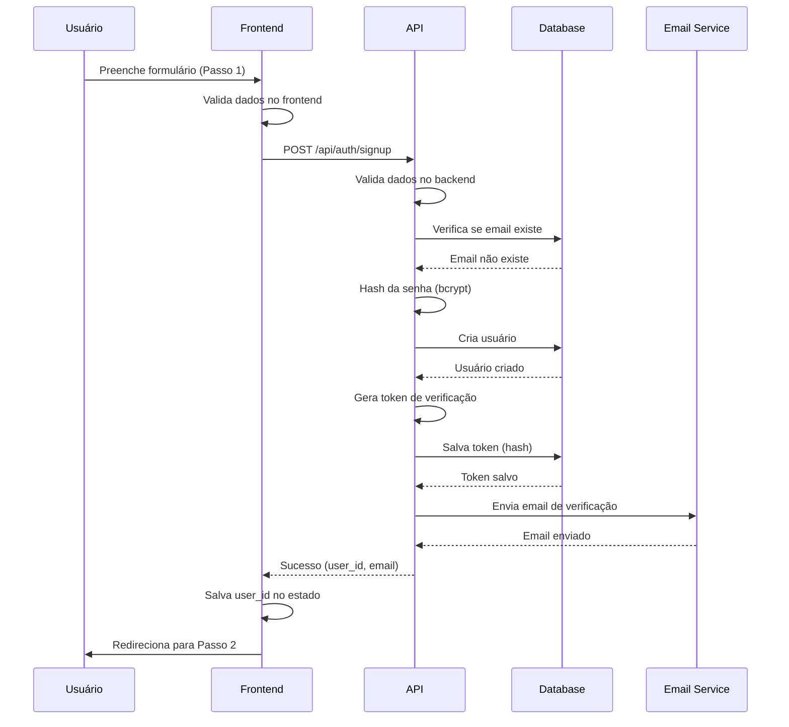
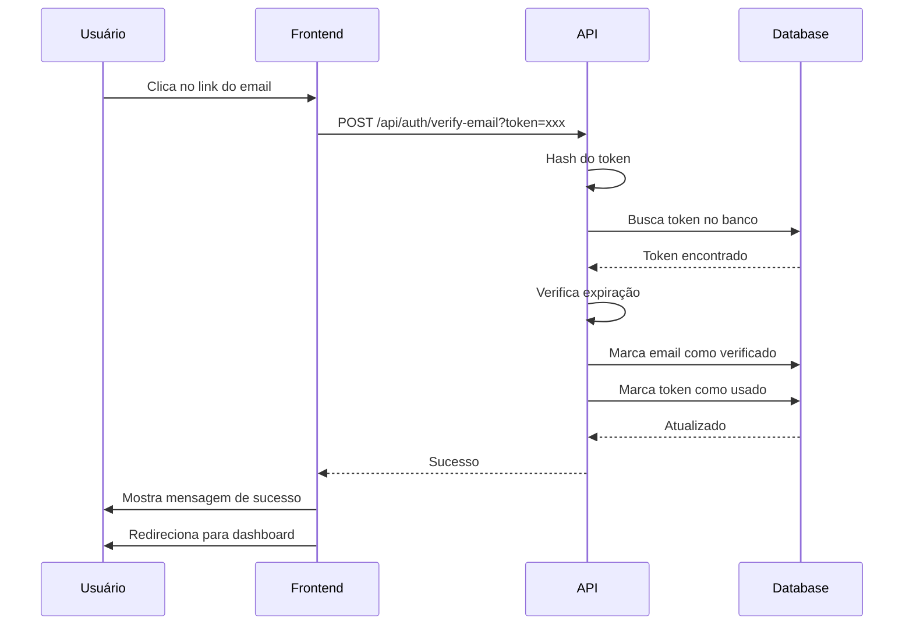
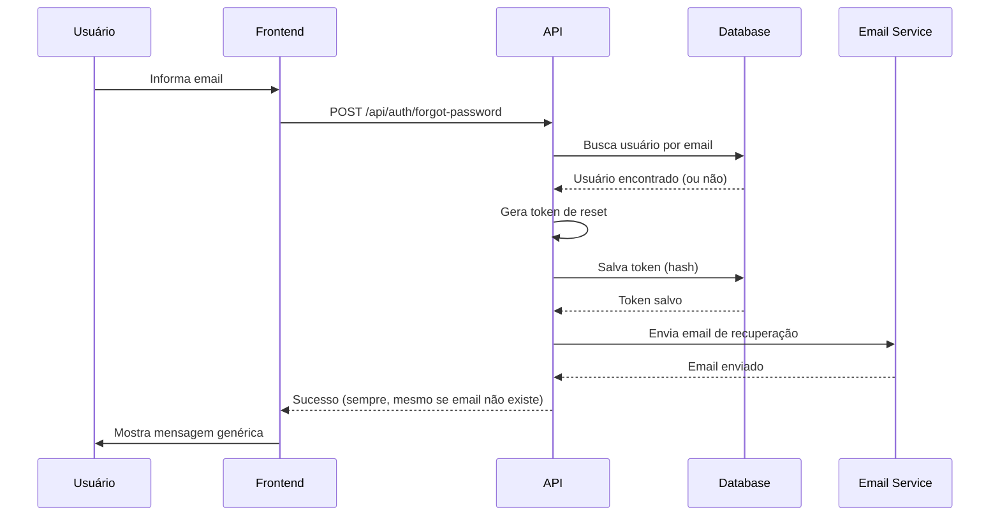
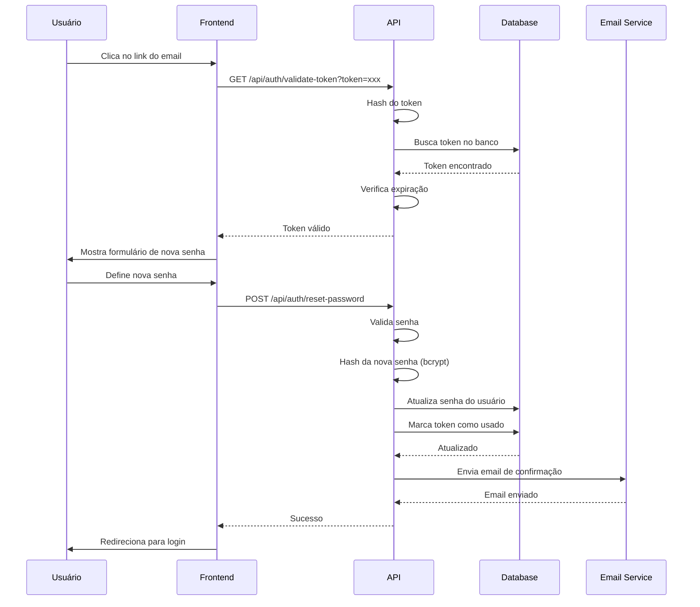

# 🏗️ Design: Sistema de Autenticação Completo

## 🎯 Arquitetura Geral

```
┌─────────────────────────────────────────────────────────────┐
│                        Frontend (Next.js)                    │
├─────────────────────────────────────────────────────────────┤
│                                                              │
│  /signup          /verify-email      /forgot-password       │
│  /reset-password  /login             /dashboard             │
│                                                              │
└──────────────────────┬──────────────────────────────────────┘
                       │
                       │ HTTP/JSON
                       │
┌──────────────────────▼──────────────────────────────────────┐
│                    API Routes (Next.js)                      │
├─────────────────────────────────────────────────────────────┤
│                                                              │
│  POST /api/auth/signup                                       │
│  POST /api/auth/verify-email                                 │
│  POST /api/auth/resend-verification                          │
│  POST /api/auth/forgot-password                              │
│  POST /api/auth/reset-password                               │
│  GET  /api/auth/validate-token                               │
│                                                              │
└──────────────────────┬──────────────────────────────────────┘
                       │
                       │ SQL
                       │
┌──────────────────────▼──────────────────────────────────────┐
│                   Database (Supabase)                        │
├─────────────────────────────────────────────────────────────┤
│                                                              │
│  users                                                       │
│  email_verification_tokens                                   │
│  password_reset_tokens                                       │
│                                                              │
└──────────────────────┬──────────────────────────────────────┘
                       │
                       │ SMTP
                       │
┌──────────────────────▼──────────────────────────────────────┐
│                   Email Service (Resend)                     │
└─────────────────────────────────────────────────────────────┘
```

---

## 📁 Estrutura de Arquivos

```
vx-disc-client-analyzer/
├── app/
│   ├── (auth)/
│   │   ├── signup/
│   │   │   └── page.tsx                    # Página de cadastro
│   │   ├── verify-email/
│   │   │   └── page.tsx                    # Verificação de email
│   │   ├── forgot-password/
│   │   │   └── page.tsx                    # Solicitar recuperação
│   │   ├── reset-password/
│   │   │   └── page.tsx                    # Redefinir senha
│   │   └── layout.tsx                      # Layout de autenticação
│   │
│   └── api/
│       ├── auth/
│       │   ├── signup/
│       │   │   └── route.ts                # POST /api/auth/signup
│       │   ├── verify-email/
│       │   │   └── route.ts                # POST /api/auth/verify-email
│       │   ├── resend-verification/
│       │   │   └── route.ts                # POST /api/auth/resend-verification
│       │   ├── forgot-password/
│       │   │   └── route.ts                # POST /api/auth/forgot-password
│       │   ├── reset-password/
│       │   │   └── route.ts                # POST /api/auth/reset-password
│       │   └── validate-token/
│       │       └── route.ts                # GET /api/auth/validate-token
│       │
│       └── user/
│           ├── profile/
│           │   └── route.ts                # GET/PATCH /api/user/profile
│           └── complete-onboarding/
│               └── route.ts                # PATCH /api/user/complete-onboarding
│
├── components/
│   ├── auth/
│   │   ├── SignupStep1.tsx                 # Dados essenciais
│   │   ├── SignupStep2.tsx                 # Dados profissionais
│   │   ├── SignupStep3.tsx                 # Preferências
│   │   ├── PasswordStrengthIndicator.tsx   # Indicador de força
│   │   ├── EmailVerificationBanner.tsx     # Banner de verificação
│   │   └── SocialLoginButtons.tsx          # Login social (futuro)
│   │
│   └── ui/
│       ├── ProgressBar.tsx                 # Barra de progresso
│       └── StepIndicator.tsx               # Indicador de passos
│
├── lib/
│   ├── auth.ts                             # Configuração NextAuth (existente)
│   ├── password.ts                         # Hash/validação (existente)
│   ├── tokens.ts                           # Geração de tokens (existente)
│   ├── email.ts                            # Envio de emails (existente)
│   ├── validation.ts                       # Validações
│   └── rateLimit.ts                        # Rate limiting (existente)
│
├── utils/
│   ├── passwordStrength.ts                 # Cálculo de força
│   └── disposableEmails.ts                 # Lista de emails descartáveis
│
├── types/
│   ├── auth.ts                             # Tipos de autenticação
│   └── user.ts                             # Tipos de usuário
│
└── emails/
    ├── templates/
    │   ├── email-verification.html         # Template de verificação
    │   ├── password-reset.html             # Template de recuperação
    │   └── password-changed.html           # Template de confirmação
    │
    └── styles/
        └── email-styles.css                # Estilos dos emails
```

---

## 🗄️ Esquema do Banco de Dados

### Migrations

#### 1. `001_create_users_table.sql`

```sql
-- Criar tabela de usuários
CREATE TABLE users (
  -- Identificação
  id UUID PRIMARY KEY DEFAULT gen_random_uuid(),
  
  -- Dados Essenciais
  name VARCHAR(100) NOT NULL,
  email VARCHAR(255) UNIQUE NOT NULL,
  password_hash VARCHAR(255) NOT NULL,
  company VARCHAR(100) NOT NULL,
  
  -- Dados Profissionais
  phone VARCHAR(20),
  is_phone_whatsapp BOOLEAN DEFAULT false,
  role VARCHAR(50),
  company_size VARCHAR(50),
  industry VARCHAR(50),
  
  -- Preferências
  referral_source VARCHAR(50),
  primary_goal VARCHAR(100),
  
  -- Verificação
  email_verified BOOLEAN DEFAULT false,
  email_verified_at TIMESTAMPTZ,
  
  -- Perfil
  profile_completed BOOLEAN DEFAULT false,
  profile_completion_percentage INT DEFAULT 40,
  onboarding_step INT DEFAULT 1,
  
  -- Consentimentos (LGPD)
  terms_accepted BOOLEAN DEFAULT false,
  terms_accepted_at TIMESTAMPTZ,
  marketing_emails_consent BOOLEAN DEFAULT false,
  
  -- Auditoria
  created_at TIMESTAMPTZ DEFAULT NOW(),
  updated_at TIMESTAMPTZ DEFAULT NOW(),
  last_login_at TIMESTAMPTZ,
  deleted_at TIMESTAMPTZ
);

-- Índices
CREATE INDEX idx_users_email ON users(email);
CREATE INDEX idx_users_created_at ON users(created_at);
CREATE INDEX idx_users_email_verified ON users(email_verified);
CREATE INDEX idx_users_deleted_at ON users(deleted_at);

-- Trigger para updated_at
CREATE OR REPLACE FUNCTION update_updated_at_column()
RETURNS TRIGGER AS $$
BEGIN
  NEW.updated_at = NOW();
  RETURN NEW;
END;
$$ LANGUAGE plpgsql;

CREATE TRIGGER update_users_updated_at
BEFORE UPDATE ON users
FOR EACH ROW
EXECUTE FUNCTION update_updated_at_column();
```

#### 2. `002_create_email_verification_tokens_table.sql`

```sql
-- Criar tabela de tokens de verificação de email
CREATE TABLE email_verification_tokens (
  id UUID PRIMARY KEY DEFAULT gen_random_uuid(),
  user_id UUID NOT NULL REFERENCES users(id) ON DELETE CASCADE,
  token_hash VARCHAR(255) NOT NULL UNIQUE,
  expires_at TIMESTAMPTZ NOT NULL,
  used_at TIMESTAMPTZ,
  created_at TIMESTAMPTZ DEFAULT NOW()
);

-- Índices
CREATE INDEX idx_email_verification_tokens_token_hash 
  ON email_verification_tokens(token_hash);
CREATE INDEX idx_email_verification_tokens_user_id 
  ON email_verification_tokens(user_id);
CREATE INDEX idx_email_verification_tokens_expires_at 
  ON email_verification_tokens(expires_at);

-- Função para limpar tokens expirados (executar diariamente)
CREATE OR REPLACE FUNCTION cleanup_expired_email_verification_tokens()
RETURNS void AS $$
BEGIN
  DELETE FROM email_verification_tokens
  WHERE expires_at < NOW() - INTERVAL '7 days';
END;
$$ LANGUAGE plpgsql;
```

#### 3. `003_create_password_reset_tokens_table.sql`

```sql
-- Criar tabela de tokens de recuperação de senha
CREATE TABLE password_reset_tokens (
  id UUID PRIMARY KEY DEFAULT gen_random_uuid(),
  user_id UUID NOT NULL REFERENCES users(id) ON DELETE CASCADE,
  token_hash VARCHAR(255) NOT NULL UNIQUE,
  expires_at TIMESTAMPTZ NOT NULL,
  used_at TIMESTAMPTZ,
  ip_address INET,
  user_agent TEXT,
  created_at TIMESTAMPTZ DEFAULT NOW()
);

-- Índices
CREATE INDEX idx_password_reset_tokens_token_hash 
  ON password_reset_tokens(token_hash);
CREATE INDEX idx_password_reset_tokens_user_id 
  ON password_reset_tokens(user_id);
CREATE INDEX idx_password_reset_tokens_expires_at 
  ON password_reset_tokens(expires_at);

-- Função para limpar tokens expirados (executar diariamente)
CREATE OR REPLACE FUNCTION cleanup_expired_password_reset_tokens()
RETURNS void AS $$
BEGIN
  DELETE FROM password_reset_tokens
  WHERE expires_at < NOW() - INTERVAL '7 days';
END;
$$ LANGUAGE plpgsql;
```

---

## 🔐 Fluxos de Autenticação

### 1. Fluxo de Signup



### 2. Fluxo de Verificação de Email



### 3. Fluxo de Forgot Password



### 4. Fluxo de Reset Password



---

## 🔒 Segurança

### 1. Hashing de Senhas

```typescript
// lib/password.ts
import bcrypt from 'bcryptjs';

const BCRYPT_COST_FACTOR = 12;

export async function hashPassword(password: string): Promise<string> {
  return await bcrypt.hash(password, BCRYPT_COST_FACTOR);
}

export async function verifyPassword(
  password: string,
  hash: string
): Promise<boolean> {
  return await bcrypt.compare(password, hash);
}
```

### 2. Hashing de Tokens

```typescript
// lib/tokens.ts
import crypto from 'crypto';

export function generateToken(): string {
  return crypto.randomBytes(32).toString('hex');
}

export function hashToken(token: string): string {
  return crypto
    .createHash('sha256')
    .update(token)
    .digest('hex');
}
```

### 3. Rate Limiting

```typescript
// lib/rateLimit.ts (estender existente)

// Signup: 5 tentativas / 15 minutos
export const signupRateLimit = rateLimit({
  interval: 15 * 60 * 1000, // 15 minutos
  uniqueTokenPerInterval: 500,
  limit: 5,
});

// Forgot Password: 3 tentativas / 15 minutos
export const forgotPasswordRateLimit = rateLimit({
  interval: 15 * 60 * 1000,
  uniqueTokenPerInterval: 500,
  limit: 3,
});

// Reset Password: 5 tentativas / 15 minutos
export const resetPasswordRateLimit = rateLimit({
  interval: 15 * 60 * 1000,
  uniqueTokenPerInterval: 500,
  limit: 5,
});
```

---

## 📧 Templates de Email

### 1. Email de Verificação

```typescript
// lib/email.ts
export function generateEmailVerificationEmail(
  name: string,
  verificationUrl: string
): string {
  return `
    <!DOCTYPE html>
    <html>
    <head>
      <meta charset="UTF-8">
      <title>Verifique seu email - VX DISC</title>
    </head>
    <body style="font-family: Arial, sans-serif; max-width: 600px; margin: 0 auto; padding: 20px;">
      <div style="background: linear-gradient(135deg, #F7971E, #FFB347); padding: 30px; text-align: center; border-radius: 10px 10px 0 0;">
        <h1 style="color: #070B10; margin: 0; font-size: 28px;">VX DISC</h1>
      </div>
      
      <div style="background: #ffffff; padding: 40px; border: 1px solid #e0e0e0; border-top: none; border-radius: 0 0 10px 10px;">
        <h2 style="color: #070B10; margin-top: 0;">Olá ${name},</h2>
        
        <p style="color: #64748B; font-size: 16px; line-height: 1.6;">
          Bem-vindo ao <strong>VX DISC Client Analyzer</strong>!
        </p>
        
        <p style="color: #64748B; font-size: 16px; line-height: 1.6;">
          Para começar a usar sua conta, precisamos verificar seu email.
        </p>
        
        <div style="text-align: center; margin: 30px 0;">
          <a href="${verificationUrl}" 
             style="background: linear-gradient(135deg, #F7971E, #FFB347); 
                    color: #070B10; 
                    padding: 15px 40px; 
                    text-decoration: none; 
                    border-radius: 8px; 
                    font-weight: bold; 
                    font-size: 16px;
                    display: inline-block;">
            Verificar Email
          </a>
        </div>
        
        <p style="color: #94A3B8; font-size: 14px; line-height: 1.6;">
          Ou copie e cole este link no seu navegador:
        </p>
        
        <p style="color: #F7971E; font-size: 12px; word-break: break-all; background: #f5f5f5; padding: 10px; border-radius: 5px;">
          ${verificationUrl}
        </p>
        
        <p style="color: #94A3B8; font-size: 14px; line-height: 1.6; margin-top: 30px;">
          Este link expira em <strong>24 horas</strong>.
        </p>
        
        <p style="color: #94A3B8; font-size: 14px; line-height: 1.6;">
          Se você não criou esta conta, ignore este email.
        </p>
        
        <hr style="border: none; border-top: 1px solid #e0e0e0; margin: 30px 0;">
        
        <p style="color: #94A3B8; font-size: 12px; text-align: center;">
          Atenciosamente,<br>
          <strong>Equipe VX Consultoria</strong>
        </p>
      </div>
    </body>
    </html>
  `;
}
```

### 2. Email de Recuperação de Senha

```typescript
export function generatePasswordResetEmail(
  name: string,
  resetUrl: string
): string {
  return `
    <!DOCTYPE html>
    <html>
    <head>
      <meta charset="UTF-8">
      <title>Recuperação de Senha - VX DISC</title>
    </head>
    <body style="font-family: Arial, sans-serif; max-width: 600px; margin: 0 auto; padding: 20px;">
      <div style="background: linear-gradient(135deg, #F7971E, #FFB347); padding: 30px; text-align: center; border-radius: 10px 10px 0 0;">
        <h1 style="color: #070B10; margin: 0; font-size: 28px;">VX DISC</h1>
      </div>
      
      <div style="background: #ffffff; padding: 40px; border: 1px solid #e0e0e0; border-top: none; border-radius: 0 0 10px 10px;">
        <h2 style="color: #070B10; margin-top: 0;">Olá ${name},</h2>
        
        <p style="color: #64748B; font-size: 16px; line-height: 1.6;">
          Você solicitou a recuperação de senha da sua conta <strong>VX DISC</strong>.
        </p>
        
        <p style="color: #64748B; font-size: 16px; line-height: 1.6;">
          Clique no botão abaixo para redefinir sua senha:
        </p>
        
        <div style="text-align: center; margin: 30px 0;">
          <a href="${resetUrl}" 
             style="background: linear-gradient(135deg, #F7971E, #FFB347); 
                    color: #070B10; 
                    padding: 15px 40px; 
                    text-decoration: none; 
                    border-radius: 8px; 
                    font-weight: bold; 
                    font-size: 16px;
                    display: inline-block;">
            Redefinir Senha
          </a>
        </div>
        
        <p style="color: #94A3B8; font-size: 14px; line-height: 1.6;">
          Ou copie e cole este link no seu navegador:
        </p>
        
        <p style="color: #F7971E; font-size: 12px; word-break: break-all; background: #f5f5f5; padding: 10px; border-radius: 5px;">
          ${resetUrl}
        </p>
        
        <p style="color: #94A3B8; font-size: 14px; line-height: 1.6; margin-top: 30px;">
          Este link expira em <strong>1 hora</strong>.
        </p>
        
        <div style="background: #FFF3E0; border-left: 4px solid #F7971E; padding: 15px; margin: 20px 0; border-radius: 5px;">
          <p style="color: #64748B; font-size: 14px; margin: 0;">
            ⚠️ Se você não solicitou esta recuperação, ignore este email.<br>
            Sua senha permanecerá inalterada.
          </p>
        </div>
        
        <hr style="border: none; border-top: 1px solid #e0e0e0; margin: 30px 0;">
        
        <p style="color: #94A3B8; font-size: 12px; text-align: center;">
          Atenciosamente,<br>
          <strong>Equipe VX Consultoria</strong>
        </p>
      </div>
    </body>
    </html>
  `;
}
```

---

## ✅ Validações

### Frontend (Zod)

```typescript
// utils/validation.ts
import { z } from 'zod';

export const signupStep1Schema = z.object({
  name: z.string()
    .min(2, 'Nome deve ter pelo menos 2 caracteres')
    .max(100, 'Nome deve ter no máximo 100 caracteres'),
  
  email: z.string()
    .email('Email inválido')
    .toLowerCase(),
  
  password: z.string()
    .min(8, 'Senha deve ter pelo menos 8 caracteres')
    .regex(/[a-zA-Z]/, 'Senha deve conter pelo menos 1 letra')
    .regex(/[0-9]/, 'Senha deve conter pelo menos 1 número'),
  
  confirmPassword: z.string(),
  
  company: z.string()
    .min(2, 'Empresa deve ter pelo menos 2 caracteres')
    .max(100, 'Empresa deve ter no máximo 100 caracteres'),
  
  termsAccepted: z.boolean()
    .refine(val => val === true, 'Você deve aceitar os Termos de Uso'),
}).refine(data => data.password === data.confirmPassword, {
  message: 'As senhas não coincidem',
  path: ['confirmPassword'],
});

export const forgotPasswordSchema = z.object({
  email: z.string()
    .email('Email inválido')
    .toLowerCase(),
});

export const resetPasswordSchema = z.object({
  password: z.string()
    .min(8, 'Senha deve ter pelo menos 8 caracteres')
    .regex(/[a-zA-Z]/, 'Senha deve conter pelo menos 1 letra')
    .regex(/[0-9]/, 'Senha deve conter pelo menos 1 número'),
  
  confirmPassword: z.string(),
}).refine(data => data.password === data.confirmPassword, {
  message: 'As senhas não coincidem',
  path: ['confirmPassword'],
});
```

---

## 🎨 Componentes UI

### PasswordStrengthIndicator

```typescript
// components/auth/PasswordStrengthIndicator.tsx
interface PasswordStrength {
  score: 0 | 1 | 2 | 3 | 4;
  label: 'Muito Fraca' | 'Fraca' | 'Média' | 'Forte' | 'Muito Forte';
  color: string;
}

export function calculatePasswordStrength(password: string): PasswordStrength {
  let score = 0;
  
  if (password.length >= 8) score++;
  if (password.length >= 12) score++;
  if (/[a-z]/.test(password) && /[A-Z]/.test(password)) score++;
  if (/[0-9]/.test(password)) score++;
  if (/[^a-zA-Z0-9]/.test(password)) score++;
  
  const labels = ['Muito Fraca', 'Fraca', 'Média', 'Forte', 'Muito Forte'];
  const colors = ['#EF4444', '#F59E0B', '#FACC15', '#22C55E', '#10B981'];
  
  return {
    score: Math.min(score, 4) as PasswordStrength['score'],
    label: labels[Math.min(score, 4)] as PasswordStrength['label'],
    color: colors[Math.min(score, 4)],
  };
}
```

---

**Status:** 🏗️ Design Técnico Completo
**Próximo Passo:** Criar tasks.md com lista de tarefas
