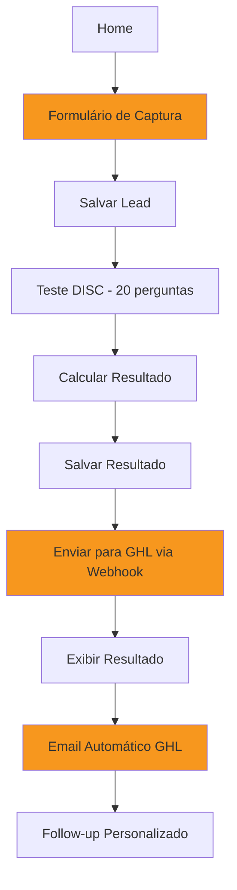

# 🚀 Fase 1 - Arquitetura Técnica: Captura + GHL

## 🎯 Objetivo

Transformar o sistema em **máquina de geração de lead qualificado** integrando:
- Captura de lead antes do teste
- Envio automático para GHL via webhook
- Tagging automática por perfil DISC
- Follow-up personalizado por perfil

---

## 📊 Fluxo Completo



---

## 🗂️ Estrutura de Arquivos (Novos)

```
vx-disc-test-app/
├── app/
│   ├── capture/
│   │   └── page.tsx              # 🆕 Formulário de captura
│   ├── api/
│   │   └── webhook/
│   │       └── ghl/
│   │           └── route.ts      # 🆕 API route para GHL
│   └── ...
│
├── types/
│   └── lead.ts                   # 🆕 Types para lead
│
├── utils/
│   ├── ghl.ts                    # 🆕 Funções GHL
│   └── validation.ts             # 🆕 Validação de formulário
│
└── .env.local                    # 🆕 Variáveis de ambiente
```

---

## 📝 1. Types para Lead

**Arquivo**: `types/lead.ts`

```typescript
export interface LeadData {
  id: string;
  name: string;
  email: string;
  phone: string;
  company?: string;
  createdAt: string;
}

export interface LeadWithResult extends LeadData {
  discResult: {
    dominant: 'D' | 'I' | 'S' | 'C';
    scores: {
      D: number;
      I: number;
      S: number;
      C: number;
    };
  };
}

export interface GHLWebhookPayload {
  contact: {
    firstName: string;
    lastName: string;
    email: string;
    phone: string;
    companyName?: string;
    tags: string[];
    customFields: {
      disc_profile: string;
      disc_d_score: number;
      disc_i_score: number;
      disc_s_score: number;
      disc_c_score: number;
    };
  };
}
```

---

## 🎨 2. Página de Captura

**Arquivo**: `app/capture/page.tsx`

```typescript
'use client';

import { useState } from 'react';
import { useRouter } from 'next/navigation';
import { Header } from '@/components/layout/Header';
import { Container } from '@/components/layout/Container';
import { Button } from '@/components/ui/Button';
import { Card } from '@/components/ui/Card';
import { saveLead } from '@/utils/storage';
import type { LeadData } from '@/types/lead';

export default function CapturePage() {
  const router = useRouter();
  const [formData, setFormData] = useState({
    name: '',
    email: '',
    phone: '',
    company: '',
  });
  const [errors, setErrors] = useState<Record<string, string>>({});
  const [isSubmitting, setIsSubmitting] = useState(false);

  const validateForm = () => {
    const newErrors: Record<string, string> = {};

    if (!formData.name.trim()) {
      newErrors.name = 'Nome é obrigatório';
    }

    if (!formData.email.trim()) {
      newErrors.email = 'Email é obrigatório';
    } else if (!/^[^\s@]+@[^\s@]+\.[^\s@]+$/.test(formData.email)) {
      newErrors.email = 'Email inválido';
    }

    if (!formData.phone.trim()) {
      newErrors.phone = 'WhatsApp é obrigatório';
    } else if (!/^\d{10,11}$/.test(formData.phone.replace(/\D/g, ''))) {
      newErrors.phone = 'WhatsApp inválido (apenas números)';
    }

    setErrors(newErrors);
    return Object.keys(newErrors).length === 0;
  };

  const handleSubmit = async (e: React.FormEvent) => {
    e.preventDefault();

    if (!validateForm()) return;

    setIsSubmitting(true);

    try {
      const leadData: LeadData = {
        id: crypto.randomUUID(),
        name: formData.name,
        email: formData.email,
        phone: formData.phone,
        company: formData.company || undefined,
        createdAt: new Date().toISOString(),
      };

      // Salvar lead no localStorage
      saveLead(leadData);

      // Navegar para o teste
      router.push('/test');
    } catch (error) {
      console.error('Erro ao salvar lead:', error);
      setErrors({ submit: 'Erro ao processar. Tente novamente.' });
    } finally {
      setIsSubmitting(false);
    }
  };

  return (
    <>
      <Header />
      <main className="min-h-screen bg-vx-dark py-12">
        <Container>
          <div className="max-w-2xl mx-auto">
            <div className="text-center mb-8">
              <h1 className="text-title md:text-title text-title-mobile text-white mb-4">
                Antes de começar
              </h1>
              <p className="text-subtitle text-vx-gray">
                Preencha seus dados para receber o resultado completo do diagnóstico DISC
              </p>
            </div>

            <Card>
              <form onSubmit={handleSubmit} className="space-y-6">
                {/* Nome */}
                <div>
                  <label htmlFor="name" className="block text-white font-semibold mb-2">
                    Nome completo *
                  </label>
                  <input
                    type="text"
                    id="name"
                    value={formData.name}
                    onChange={(e) => setFormData({ ...formData, name: e.target.value })}
                    className={`
                      w-full px-4 py-3 rounded-lg bg-vx-dark border-2
                      text-white placeholder-vx-gray
                      focus:outline-none focus:border-vx-orange
                      transition-colors
                      ${errors.name ? 'border-red-500' : 'border-white/[0.08]'}
                    `}
                    placeholder="Seu nome completo"
                  />
                  {errors.name && (
                    <p className="text-red-500 text-sm mt-1">{errors.name}</p>
                  )}
                </div>

                {/* Email */}
                <div>
                  <label htmlFor="email" className="block text-white font-semibold mb-2">
                    Email *
                  </label>
                  <input
                    type="email"
                    id="email"
                    value={formData.email}
                    onChange={(e) => setFormData({ ...formData, email: e.target.value })}
                    className={`
                      w-full px-4 py-3 rounded-lg bg-vx-dark border-2
                      text-white placeholder-vx-gray
                      focus:outline-none focus:border-vx-orange
                      transition-colors
                      ${errors.email ? 'border-red-500' : 'border-white/[0.08]'}
                    `}
                    placeholder="seu@email.com"
                  />
                  {errors.email && (
                    <p className="text-red-500 text-sm mt-1">{errors.email}</p>
                  )}
                </div>

                {/* WhatsApp */}
                <div>
                  <label htmlFor="phone" className="block text-white font-semibold mb-2">
                    WhatsApp *
                  </label>
                  <input
                    type="tel"
                    id="phone"
                    value={formData.phone}
                    onChange={(e) => setFormData({ ...formData, phone: e.target.value })}
                    className={`
                      w-full px-4 py-3 rounded-lg bg-vx-dark border-2
                      text-white placeholder-vx-gray
                      focus:outline-none focus:border-vx-orange
                      transition-colors
                      ${errors.phone ? 'border-red-500' : 'border-white/[0.08]'}
                    `}
                    placeholder="(11) 99999-9999"
                  />
                  {errors.phone && (
                    <p className="text-red-500 text-sm mt-1">{errors.phone}</p>
                  )}
                </div>

                {/* Empresa (Opcional) */}
                <div>
                  <label htmlFor="company" className="block text-white font-semibold mb-2">
                    Empresa (opcional)
                  </label>
                  <input
                    type="text"
                    id="company"
                    value={formData.company}
                    onChange={(e) => setFormData({ ...formData, company: e.target.value })}
                    className="
                      w-full px-4 py-3 rounded-lg bg-vx-dark border-2 border-white/[0.08]
                      text-white placeholder-vx-gray
                      focus:outline-none focus:border-vx-orange
                      transition-colors
                    "
                    placeholder="Nome da sua empresa"
                  />
                </div>

                {/* Erro de Submit */}
                {errors.submit && (
                  <div className="bg-red-500/10 border border-red-500 rounded-lg p-4">
                    <p className="text-red-500 text-sm">{errors.submit}</p>
                  </div>
                )}

                {/* Botão Submit */}
                <Button
                  type="submit"
                  variant="primary"
                  disabled={isSubmitting}
                  className="w-full"
                >
                  {isSubmitting ? 'Processando...' : 'Iniciar Diagnóstico'}
                </Button>

                <p className="text-vx-gray text-sm text-center">
                  Seus dados estão seguros e não serão compartilhados.
                </p>
              </form>
            </Card>
          </div>
        </Container>
      </main>
    </>
  );
}
```

---

## 💾 3. Storage para Lead

**Arquivo**: `utils/storage.ts` (adicionar ao existente)

```typescript
import type { LeadData } from '@/types/lead';

// Adicionar nova chave
export const STORAGE_KEYS = {
  TEST: 'vx_disc_test',
  RESULT: 'vx_disc_result',
  LEAD: 'vx_disc_lead', // 🆕
} as const;

// Salvar lead
export function saveLead(lead: LeadData): void {
  if (typeof window === 'undefined') return;
  
  try {
    localStorage.setItem(STORAGE_KEYS.LEAD, JSON.stringify(lead));
  } catch (error) {
    console.error('Erro ao salvar lead:', error);
  }
}

// Carregar lead
export function loadLead(): LeadData | null {
  if (typeof window === 'undefined') return null;
  
  try {
    const data = localStorage.getItem(STORAGE_KEYS.LEAD);
    return data ? JSON.parse(data) : null;
  } catch (error) {
    console.error('Erro ao carregar lead:', error);
    return null;
  }
}
```

---

## 🔗 4. Integração GHL

**Arquivo**: `utils/ghl.ts`

```typescript
import type { LeadWithResult, GHLWebhookPayload } from '@/types/lead';

const GHL_WEBHOOK_URL = process.env.NEXT_PUBLIC_GHL_WEBHOOK_URL || '';

const profileTags: Record<string, string> = {
  D: 'disc_d',
  I: 'disc_i',
  S: 'disc_s',
  C: 'disc_c',
};

export async function sendToGHL(leadWithResult: LeadWithResult): Promise<boolean> {
  if (!GHL_WEBHOOK_URL) {
    console.warn('GHL Webhook URL não configurada');
    return false;
  }

  try {
    const [firstName, ...lastNameParts] = leadWithResult.name.split(' ');
    const lastName = lastNameParts.join(' ') || '';

    const payload: GHLWebhookPayload = {
      contact: {
        firstName,
        lastName,
        email: leadWithResult.email,
        phone: leadWithResult.phone,
        companyName: leadWithResult.company,
        tags: [
          'disc_lead',
          profileTags[leadWithResult.discResult.dominant],
        ],
        customFields: {
          disc_profile: leadWithResult.discResult.dominant,
          disc_d_score: leadWithResult.discResult.scores.D,
          disc_i_score: leadWithResult.discResult.scores.I,
          disc_s_score: leadWithResult.discResult.scores.S,
          disc_c_score: leadWithResult.discResult.scores.C,
        },
      },
    };

    const response = await fetch(GHL_WEBHOOK_URL, {
      method: 'POST',
      headers: {
        'Content-Type': 'application/json',
      },
      body: JSON.stringify(payload),
    });

    if (!response.ok) {
      throw new Error(`GHL webhook failed: ${response.status}`);
    }

    console.log('Lead enviado para GHL com sucesso');
    return true;
  } catch (error) {
    console.error('Erro ao enviar para GHL:', error);
    return false;
  }
}
```

---

## 🔄 5. Atualizar Página de Resultado

**Arquivo**: `app/result/page.tsx` (modificar)

Adicionar envio para GHL após carregar resultado:

```typescript
useEffect(() => {
  const savedResult = loadResult();
  const savedLead = loadLead();
  
  if (!savedResult) {
    router.push('/?error=no-data');
    return;
  }
  
  setResult(savedResult);
  
  // 🆕 Enviar para GHL se houver lead
  if (savedLead) {
    const leadWithResult: LeadWithResult = {
      ...savedLead,
      discResult: {
        dominant: savedResult.dominant,
        scores: savedResult.scores,
      },
    };
    
    sendToGHL(leadWithResult).catch(console.error);
  }
  
  setLoading(false);
}, [router]);
```

---

## 🔐 6. Variáveis de Ambiente

**Arquivo**: `.env.local` (criar)

```env
# GHL Webhook URL
NEXT_PUBLIC_GHL_WEBHOOK_URL=https://services.leadconnectorhq.com/hooks/YOUR_WEBHOOK_ID

# Outras variáveis futuras
# NEXT_PUBLIC_SUPABASE_URL=
# NEXT_PUBLIC_SUPABASE_ANON_KEY=
```

**Adicionar ao `.gitignore`**:
```
.env.local
.env*.local
```

---

## 🔄 7. Atualizar Fluxo de Navegação

**Arquivo**: `app/page.tsx` (modificar botão)

```typescript
<Button variant="primary" href="/capture">
  Iniciar Diagnóstico
</Button>
```

---

## 📋 Checklist de Implementação

### Fase 1.1 - Captura de Lead
- [ ] Criar `types/lead.ts`
- [ ] Criar `app/capture/page.tsx`
- [ ] Atualizar `utils/storage.ts` (adicionar lead)
- [ ] Atualizar botão home para `/capture`
- [ ] Testar formulário localmente

### Fase 1.2 - Integração GHL
- [ ] Criar conta GHL (se não tiver)
- [ ] Criar webhook no GHL
- [ ] Copiar URL do webhook
- [ ] Criar `.env.local` com URL
- [ ] Criar `utils/ghl.ts`
- [ ] Atualizar `app/result/page.tsx`
- [ ] Testar envio para GHL

### Fase 1.3 - Automação GHL
- [ ] Criar workflow no GHL
- [ ] Configurar tags (disc_d, disc_i, disc_s, disc_c)
- [ ] Criar pipeline "DISC Leads"
- [ ] Configurar email automático
- [ ] Criar follow-up personalizado por perfil
- [ ] Testar fluxo completo

---

## 🧪 Testes

### Teste Local
1. Preencher formulário de captura
2. Completar teste DISC
3. Ver resultado
4. Verificar console (log de envio GHL)

### Teste GHL
1. Verificar contato criado no GHL
2. Verificar tags aplicadas
3. Verificar custom fields preenchidos
4. Verificar pipeline atualizado
5. Verificar email enviado

---

## 📊 Métricas para Acompanhar

Após implementação:
- Taxa de conversão (captura → teste completo)
- Taxa de conclusão do teste
- Distribuição de perfis (D, I, S, C)
- Taxa de resposta por perfil
- Taxa de conversão por perfil

---

## 🚀 Próximos Passos (Fase 2)

Após validar Fase 1 com 10-20 leads:
1. Adicionar Supabase (backend real)
2. Implementar IA para análise
3. Criar dashboard analytics
4. Gerar PDF do resultado

---

**🎯 Implemente essa fase assim que a migração estiver completa!**
