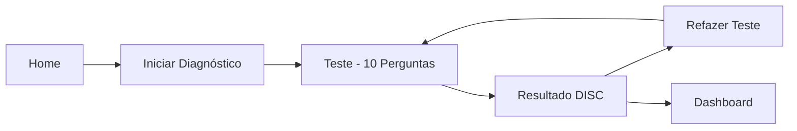

# VX Consultoria - Diagnóstico DISC Profissional

<div align="center">


**Aplicação web profissional para diagnóstico comportamental DISC**

Especializada em Estruturação Comercial e Qualificação de Leads

[Demo](https://vx-disc-test-app.vercel.app) • [Instalação](#-instalação) • [Documentação](#-documentação)

</div>

---

## 🎯 Sobre o Projeto

Sistema de diagnóstico comportamental baseado na metodologia DISC, desenvolvido para a **VX Consultoria** com foco em:

- 🎨 **Identidade Visual VX**: Laranja (#F7971E) + Preto (#0B0F14)
- 💼 **Foco Comercial**: Qualificação de leads e performance de vendas
- 🚀 **Experiência Premium**: Design profissional tipo SaaS
- 📊 **Insights Acionáveis**: Recomendações práticas por perfil

---

## ✨ Funcionalidades

### 🏠 Home Page
- Hero section impactante com identidade VX
- Benefícios do teste DISC
- Como funciona (3 passos)
- CTA: "Caminhamos lado a lado com seu time de vendas"

### 📝 Teste DISC
- 10 perguntas objetivas
- Barra de progresso visual (laranja)
- Navegação anterior/próxima
- Persistência automática (localStorage)
- Loading states premium

### 📊 Resultado
- Perfil dominante destacado (D, I, S, C)
- Pontuações detalhadas
- Pontos fortes
- Estilo de comunicação
- Abordagem comercial personalizada
- CTA para aplicação comercial

### 📈 Dashboard
- Métricas de testes realizados
- Taxa de conclusão
- Leads qualificados
- Distribuição de perfis DISC
- Design profissional VX

---

## 🛠️ Tecnologias

- **Framework**: Next.js 14 (App Router)
- **Linguagem**: TypeScript
- **Estilo**: TailwindCSS
- **Persistência**: localStorage
- **Deploy**: Vercel

---

## 🚀 Instalação

### Pré-requisitos
- Node.js 18+
- npm ou yarn

### Passo a Passo

```bash
# 1. Clonar/Copiar o projeto
cd C:\Users\Julio\Documents\vx-projects\disc-app

# 2. Instalar dependências
npm install

# 3. Rodar em desenvolvimento
npm run dev

# 4. Abrir no navegador
# http://localhost:3000
```

### Deploy no Vercel

```bash
# Instalar Vercel CLI
npm install -g vercel

# Login
vercel login

# Deploy
vercel --prod
```

📖 **Guia completo**: Veja [INSTALACAO.md](./INSTALACAO.md)

---

## 🎨 Identidade Visual

### Cores VX

```css
--vx-orange: #F7971E;      /* Laranja principal */
--vx-dark: #0B0F14;        /* Preto/Cinza escuro */
--vx-dark-secondary: #1A1F26; /* Cinza secundário */
--vx-gray: #8B92A0;        /* Cinza texto */
```

### Tipografia
- **Fonte**: Inter
- **Estilo**: Bold, impactante, maiúsculas
- **Tom**: Profissional, orientado a resultados

---

## 📁 Estrutura do Projeto

```
disc-app/
├── app/                    # Páginas Next.js
│   ├── page.tsx            # Home (identidade VX)
│   ├── test/page.tsx       # Teste DISC
│   ├── result/page.tsx     # Resultado
│   ├── dashboard/page.tsx  # Dashboard
│   ├── layout.tsx          # Layout global
│   └── globals.css         # Estilos VX
│
├── components/             # Componentes reutilizáveis
│   ├── Button.tsx          # Botão VX (laranja)
│   ├── Card.tsx            # Card VX
│   ├── ProgressBar.tsx     # Barra de progresso
│   └── Logo.tsx            # Logo VX
│
├── data/                   # Dados
│   ├── questions.ts        # 10 perguntas DISC
│   └── profiles.ts         # Descrições dos perfis
│
├── types/                  # TypeScript
│   └── disc.ts             # Interfaces DISC
│
├── utils/                  # Utilitários
│   ├── calculateDISC.ts    # Algoritmo de cálculo
│   └── storage.ts          # localStorage
│
└── tailwind.config.ts      # Config TailwindCSS (cores VX)
```

---

## 🧪 Perfis DISC

### D - Dominância
- **Características**: Orientado para resultados, direto, focado em objetivos
- **Cor**: Vermelho
- **Abordagem**: Decisões rápidas, foco em eficiência

### I - Influência
- **Características**: Comunicativo, entusiasta, motivado por reconhecimento
- **Cor**: Amarelo
- **Abordagem**: Relacionamento, networking, persuasão

### S - Estabilidade
- **Características**: Confiável, paciente, valoriza harmonia
- **Cor**: Verde
- **Abordagem**: Consistência, suporte, trabalho em equipe

### C - Conformidade
- **Características**: Analítico, preciso, orientado por dados
- **Cor**: Azul
- **Abordagem**: Análise detalhada, qualidade, processos

---

## 📊 Fluxo do Usuário



---

## 🔧 Comandos

```bash
# Desenvolvimento
npm run dev

# Build
npm run build

# Produção local
npm start

# Lint
npm run lint

# Deploy Vercel
vercel --prod
```

---

## ✅ Checklist de Validação

Após deploy, verifique:

- [ ] Home carrega com identidade VX
- [ ] Logo VX aparece corretamente
- [ ] Cores laranja e preto aplicadas
- [ ] Teste completo funciona (10 perguntas)
- [ ] Barra de progresso laranja
- [ ] Resultado mostra perfil DISC
- [ ] Dashboard com métricas
- [ ] Responsivo em mobile
- [ ] Sem erros no console
- [ ] Performance > 80 (Lighthouse)

---

## 📈 Roadmap

### ✅ Fase 0 - MVP (Concluído)
- [x] Home page com identidade VX
- [x] Teste DISC (10 perguntas)
- [x] Cálculo de perfil
- [x] Página de resultado
- [x] Dashboard básico
- [x] Design responsivo

### 🚧 Fase 1 - Captura de Leads (Próximo)
- [ ] Formulário de captura (nome, email, WhatsApp)
- [ ] Integração com GoHighLevel (GHL)
- [ ] Webhook para CRM
- [ ] Tags automáticas por perfil
- [ ] Follow-up personalizado

### 🔮 Fase 2 - IA e Automação
- [ ] Análise de perfil com IA
- [ ] Geração de copy personalizado
- [ ] Scripts de abordagem automáticos
- [ ] Email marketing por perfil
- [ ] WhatsApp automático

### 🎯 Fase 3 - SaaS Completo
- [ ] Autenticação de usuários
- [ ] Dashboard com analytics real
- [ ] Exportação de relatórios PDF
- [ ] Integração Meta Ads
- [ ] Multi-tenancy

---

## 🤝 Contribuindo

Este é um projeto proprietário da **VX Consultoria**.

Para sugestões ou melhorias, entre em contato.

---

## 📄 Licença

Projeto proprietário - Todos os direitos reservados © 2026 VX Consultoria

---

## 📞 Contato

**VX Consultoria**
- Especializada em Estruturação Comercial
- Implantação de CRM
- Qualificação de Leads

---

<div align="center">

**Desenvolvido com 🧡 pela VX Consultoria**

[Website](https://vx-consultoria.com) • [LinkedIn](https://linkedin.com/company/vx-consultoria)

</div>
